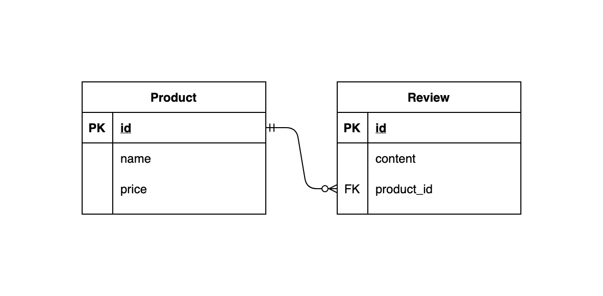

# Monolithic to Microservice

## 개요

- Monolithic Architecture 기반의 Application을 Microservice Architecture로 전환

## 목표

- Microservice Architecture의 구조에 대한 이해
- Microservice 간 REST API를 활용한 통신
- Service Discovery Server 구축
- Microservice Architecture의 API Gateway 구축
- Configuration Service 구축 (선택)
- Resilience4j를 활용한 Fault Tolerance에 대한 이해 (선택)

## 준비 사항

- Spring Boot >= 2.4
- MySQL Server >= 8.0 (Docker or Local 설치)
    - Docker 또는 Local 설치 방식으로 MySQL Server 활용
    - 주어진 Monolithic Application의 Database (Docker)

        ```bash
        $ docker run --name project-01 -e MYSQL_ROOT_PASSWORD=root -e MYSQL_USER=coupang -e MYSQL_PASSWORD=coupang -e MYSQL_DATABASE=project-01 -p 3306:3306 -d mysql:8.0
        ```

    - 분리 후, 각 Service 마다 독립적인 Database 사용 (Docker)

        ```bash
        $ docker run --name {CONTAINER_NAME} -e MYSQL_ROOT_PASSWORD=root -e MYSQL_USER=coupang -e MYSQL_PASSWORD=coupang -e MYSQL_DATABASE={DATABASE_NAME} -p {PORT}:3306 -d mysql:8.0
        ```


## (참고) Monolitic Application

### 1. Database Scheme

- 상품(Product)은 상품명(name)과 가격(price)으로 구성
- 리뷰(Review)는 내용(content)과 어떤 상품의 리뷰인지(product_id)에 대한 값으로 구성
- Entity Relationship Diagram (ERD)

    


### 2. Endpoints

#### 2.1. `GET /products`
- 모든 상품 조회
- Response 예시

    ```json
    [
        {
            "id": 1,
            "name": "물",
            "price": 1000,
            "reviews": []
        },
        {
            "id": 2,
            "name": "콜라",
            "price": 5000,
            "reviews": [
                {
                    "id": 1,
                    "content": "너무 비싸요 :("
                }
            ]
        }
    ]
    ```


#### 2.2. `POST /products`
- 새 상품 생성
- Request Body
    - (필수) `name` - 상품명
    - (필수) `price` - 가격
- Request 예시
    - `POST /products`

        ```json
        {
            "name": "물",
            "price": 1000
        }
        ```

- Response 예시

    ```json
    {
        "id": 1,
        "name": "물",
        "price": 1000,
        "reviews": []
    }
    ```

#### 2.3. `GET /products/{id}`
    - 특정 상품 정보 조회
    - Request 예시
        - `GET /products/1`
    - Response 예시

        ```json
        {
            "id": 1,
            "name": "물",
            "price": 1000,
            "reviews": []
        }
        ```

#### 2.4. `PUT /products/{id}`
    - 특정 상품 정보 수정(업데이트)
    - Request Body
        - (필수) `name` - 상품명
        - (필수) `price` - 가격
    - Request 예시
        - `PUT /products/1`

            ```json
            {
              "name": "물",
              "price": 2000
            }
            ```

    - Response 예시

        ```json
        {
            "id": 1,
            "name": "물",
            "price": 2000,
            "reviews": []
        }
        ```


#### 2.5. `DELETE /products/{id}`
- 특정 상품 삭제
- Request 예시
    - `DELETE /products/1`
- Response 예시
    - 204 No Content


#### 2.6. `POST /products/{product_id}/reviews`
- 특정 상품의 리뷰 생성
- Request Body
    - (필수) `content` - 리뷰 내용
- Request 예시
    - `POST /products/1/reviews`

        ```json
        {
            "content": "너무 비싸요 :("
        }
        ```

- Response 예시

    ```json
    {
        "id": 1,
        "content": "너무 비싸요 :(",
        "product": {
            "id": 1,
            "name": "물",
            "price": 2000
        }
    }
    ```

#### 2.7. `DELETE /products/{product_id}/reviews/{id}`
- 특정 리뷰 삭제
- Request 예시
    - `DELETE /products/1/reviews/2` - id가 1인 상품의 리뷰 중에서, id가 2인 리뷰 삭제
- Response 예시
    - 204 No Content


## 요구 사항

- 주어진 '상품 리뷰' REST API Application을 상품(Product) 서비스와 리뷰(Review) 서비스로 분리하여 Microservice Architecture로 구성
- 클라이언트로부터의 요청은 단일 Host로 된 API Gateway를 통과해 각 서비스로 전달되도록 구현


### 0. 주의 사항

- Microsevice의 원칙에 따라 서비스들을 분리
- 분리된 Microsevice 간 통신은 REST API를 활용
- 아래의 명세에 명시되지 않은 내용은 **자유롭게** 구현


### 1. Microservices

- Product Service와 Review Service로 분리
- 각 Service 마다 독립된 Database 사용
- REST Client 라이브러리를 사용하여, 각 Service 간 통신 구현


### 2. Service Discovery

- 분리된 Service들을 Service Discovery에 등록
- REST 호출 시, 각 Service의 위치를 직접적으로 사용하지 않고 Serivce Discovery를 사용


### 3. API Gateway

- Spring Cloud Gateway를 활용하여 호출 지점을 하나로 통합
- Endpoint는 자유롭게 구성


### 4. Spring Cloud Config (선택)

- Spring Cloud Config Server를 활용하여 각 서비스의 설정 파일을 통합 관리


### 5. Resilience4j (선택)

- 서비스 간 REST API 통신 시, Resilience4j를 활용하여 Fallback, Bulkhead, Retry 등의 전략 수립


## 제출 방법

- Git을 통해 프로젝트 URL의 GitHub repository를 로컬로 clone

    ```bash
    $ git clone https://github.com/coupang-edu/a4e-msa-project-01
    $ cd a4e-msa-project-01
    ```

- 본인의 `사내 이메일의 아이디 부분`으로 branch 생성 및 이동

    ```bash
    $ git switch -c john
    ```

- 코드 작성이 완료된 프로젝트를, 아래와 같이 프로젝트 폴더명을 본인의 영문명으로 변경

    ```bash
    README.md
    john/
        ├── eureka-server
        │   ├── ...
        │   └── ...
        ├── product-service
        │   ├── ...
        │   └── ...
        └── review-service
            ├── gradle/
            ├── src/
            ├── build.gradle
            ├── gradlew
            ├── gradlew.bat
            └── settings.gradle
    ```

- 코드 작성 완료 후, 해당 branch를 push

    ```bash
    $ git push origin john
    ```

- Pull Request 생성하여 제출 완료
